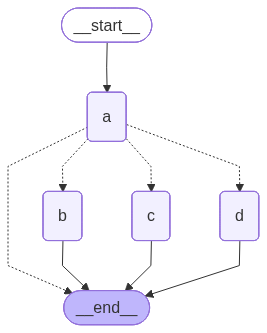
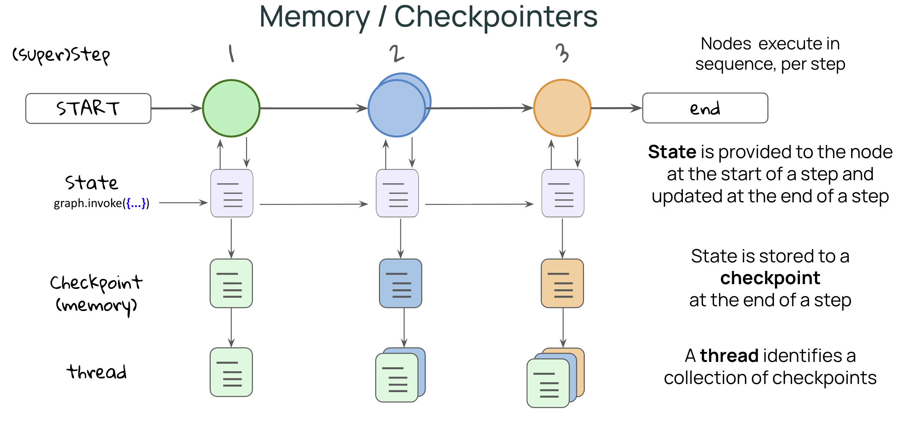
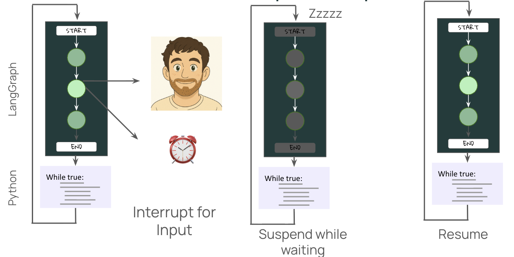

# LangGraph Essentials 🦜🔗

A simple repository covering the fundamentals of building AI Agents and workflows using **LangGraph**.

## 📂 Project Structure

* **`notebooks/`**: Contains the Jupyter notebooks demonstrating the concepts interactively:
  * [notebooks/nodes.ipynb](notebooks/nodes.ipynb)
  * [notebooks/edges.ipynb](notebooks/edges.ipynb)
  * [notebooks/conditional_edges.ipynb](notebooks/conditional_edges.ipynb)
  * [notebooks/memory.ipynb](notebooks/memory.ipynb)
  * [notebooks/interrupt.ipynb](notebooks/interrupt.ipynb)
* **`src/`**: Contains clean, structured python execution scripts representing key lessons:
  * [src/nodes.py](src/nodes.py)
  * [src/edges.py](src/edges.py)
  * [src/conditional_edges.py](src/conditional_edges.py)
  * [src/memory.py](src/memory.py)
  * [src/interrupt.py](src/interrupt.py)
* **`assets/`**: Flowcharts and architecture diagrams for the workflows:
  * [assets/nodes.png](assets/nodes.png)
  * [assets/edges.png](assets/edges.png)
  * [assets/conditional_edges.png](assets/conditional_edges.png)
  * [assets/Memory.png](assets/Memory.png)
  * [assets/intrrupt.png](assets/intrrupt.png)
  * [assets/HITL.png](assets/HITL.png)
* **`requirements.txt`**: Package dependencies.

---

## 💡 Lesson 1: States & Nodes

### Key Takeaways:
* **State**: The shared memory or schema of the graph, defined using `TypedDict`.
* **Nodes**: Python functions that receive the current state, run specific logic, and return updated state attributes.
* **Linear Flow**: Direct routing from one node sequentially to another (`START -> Node -> END`).

### Graph Flowchart:


---

## 💡 Lesson 2: Parallel Edges & Reducers

### Key Takeaways:
* **Parallel Routing**: Branching execution from a single node into multiple concurrent paths (fan-out) before merging them back (fan-in).
* **Reducers**: Functions (like `operator.concat`) used to specify how state updates from concurrent paths are merged over time instead of overwriting each other.

### Graph Flowchart:


---

## 💡 Lesson 3: Conditional Edges & Routing

### Key Takeaways:
* **Dynamic Routing**: Deciding the next node(s) to visit dynamically at runtime.
* **`Command` Object**: By returning a `Command` object, a node can update the state and declare the target transition path dynamically using routing parameters like `goto`.

### Graph Flowchart:


---

## 💡 Lesson 4: State Persistence (Memory)

### Key Takeaways:
* **Checkpointers**: InMemorySaver simulates a database saving checkpoints of the state at each step of graph execution.
* **Thread Configuration Matched Sessions**: Supplying a `thread_id` allows retrieval, resumption, and persistence of conversation history across different invocation requests.

### Graph Flowchart:


---

## 💡 Lesson 5: Human-In-The-Loop & Interrupts

### Key Takeaways:
* **`interrupt()` Helper**: Pauses graph execution during specific logic verification to ask for human confirmation or input, raising structured queries.
* **Resuming interrupted flows**: Passing a resume Command (via `Command(resume=...)`) re-triggers workflow completion from the exact step where execution halted.

### Graph Flowcharts & Diagrams:


---

## 🛠️ Setup & Installation

1. **Create and activate a virtual environment:**
   - **Windows (PowerShell):**
     ```powershell
     python -m venv venv
     .\venv\Scripts\Activate.ps1
     ```
   - **macOS / Linux:**
     ```bash
     python3 -m venv venv
     source venv/bin/activate
     ```

2. **Install dependencies:**
   ```bash
   pip install -r requirements.txt
   ```
