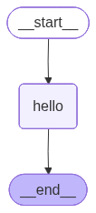
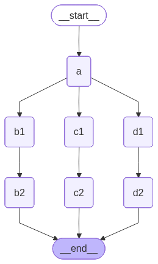

# LangGraph Essentials 🦜🔗

A simple repository covering the fundamentals of building AI Agents and workflows using **LangGraph**.

## 📂 Project Structure

* **`nodes.ipynb` / `nodes.py`**
* **`edges.ipynb` / `edges.py`**
* **`nodes.png` / `edges.png`**
* **`requirements.txt`**

---

## 💡 Lesson 1: States & Nodes

### Key Takeaways:
* **State**: The shared memory or schema of the graph, defined using `TypedDict`.
* **Nodes**: Python functions that receive the current state, run specific logic, and return updated state attributes.
* **Linear Flow**: Direct routing from one node sequentially to another (`START -> Node -> END`).

### Graph Flowchart:


---

## 💡 Lesson 2: Parallel Edges & Reducers

### Key Takeaways:
* **Parallel Routing**: Branching execution from a single node into multiple concurrent paths (fan-out) before merging them back (fan-in).
* **Reducers**: Functions (like `operator.concat`) used to specify how state updates from concurrent paths are merged over time instead of overwriting each other.

### Graph Flowchart:


---

## 🛠️ Setup & Installation

1. **Create and activate a virtual environment:**
   - **Windows (PowerShell):**
     ```powershell
     python -m venv venv
     .\venv\Scripts\Activate.ps1
     ```
   - **macOS / Linux:**
     ```bash
     python3 -m venv venv
     source venv/bin/activate
     ```

2. **Install dependencies:**
   ```bash
   pip install -r requirements.txt
   ```
